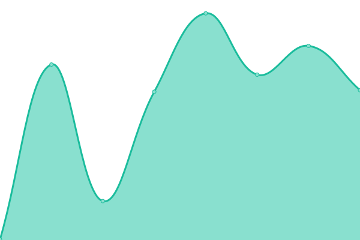
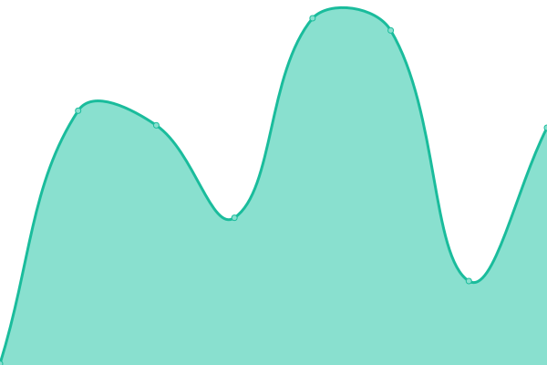
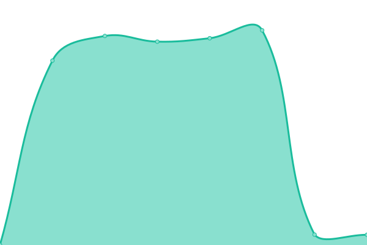

# [📈 Live Status](https://yolominds.github.io/Status): <!--live status--> **🟩 All systems operational**

This repository contains the open-source uptime monitor and status page for [Yolominds](https://yolominds.github.io/Status), powered by [Upptime](https://github.com/upptime/upptime).

With [Upptime](https://upptime.js.org), you can get your own unlimited and free uptime monitor and status page, powered entirely by a GitHub repository. We use [Issues](https://github.com/yolominds/Status/issues) as incident reports, [Actions](https://github.com/yolominds/Status/actions) as uptime monitors, and [Pages](https://yolominds.github.io/Status) for the status page.

<!--start: status pages-->
<!-- This summary is generated by Upptime (https://github.com/upptime/upptime) -->
<!-- Do not edit this manually, your changes will be overwritten -->
<!-- prettier-ignore -->
| URL | Status | History | Response Time | Uptime |
| --- | ------ | ------- | ------------- | ------ |
|  [SeacowsAPI](https://api.seacows.io/ping/) | 🟩 Up | [seacows-api.yml](https://github.com/yolominds/status-page/commits/HEAD/history/seacows-api.yml) | 

 250ms
     
 | 

<a href="https://yolominds.github.io/status-page/history/seacows-api">100.00%</a>
    

|  [PreSeacowsAPI](https://pre-api.seacows.io/ping/) | 🟩 Up | [pre-seacows-api.yml](https://github.com/yolominds/status-page/commits/HEAD/history/pre-seacows-api.yml) | 

 186ms
     
 | 

<a href="https://yolominds.github.io/status-page/history/pre-seacows-api">100.00%</a>
    

|  [SeacowsFront](https://seacows.io/) | 🟩 Up | [seacows-front.yml](https://github.com/yolominds/status-page/commits/HEAD/history/seacows-front.yml) | 

 2833ms
     
 | 

<a href="https://yolominds.github.io/status-page/history/seacows-front">100.00%</a>
    

<!--end: status pages-->

[**Visit our status website →**](https://yolominds.github.io/Status)

## 📄 License

- Powered by: [Upptime](https://github.com/upptime/upptime)
- Code: [MIT](./LICENSE) © [Yolominds](https://yolominds.github.io/Status)
- Data in the `./history` directory: [Open Database License](https://opendatacommons.org/licenses/odbl/1-0/)
